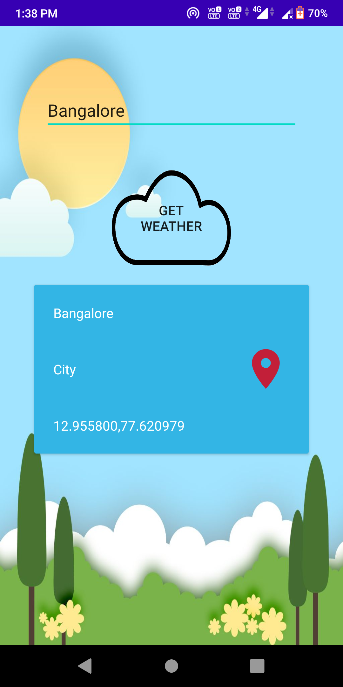
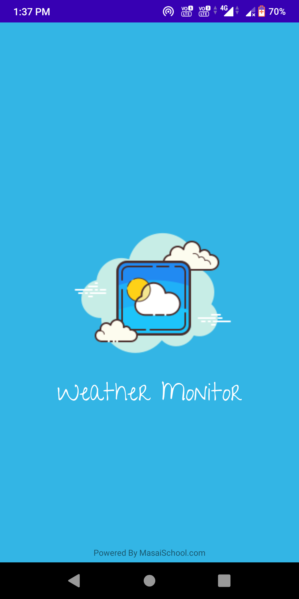
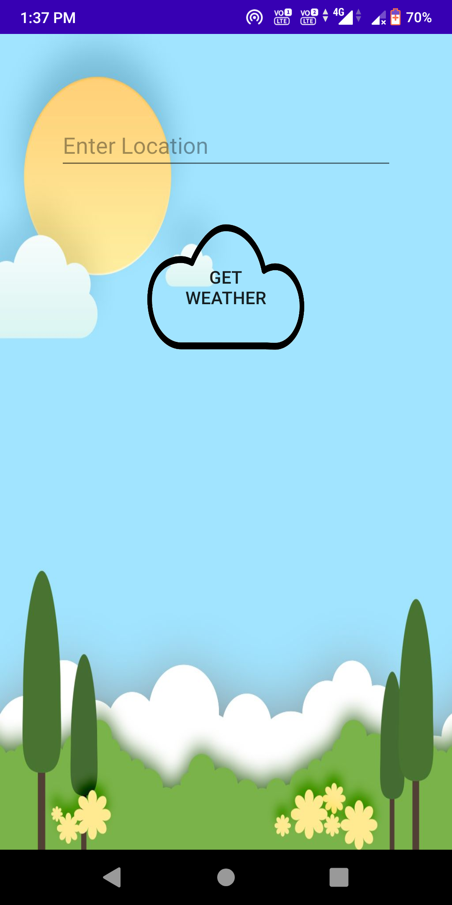
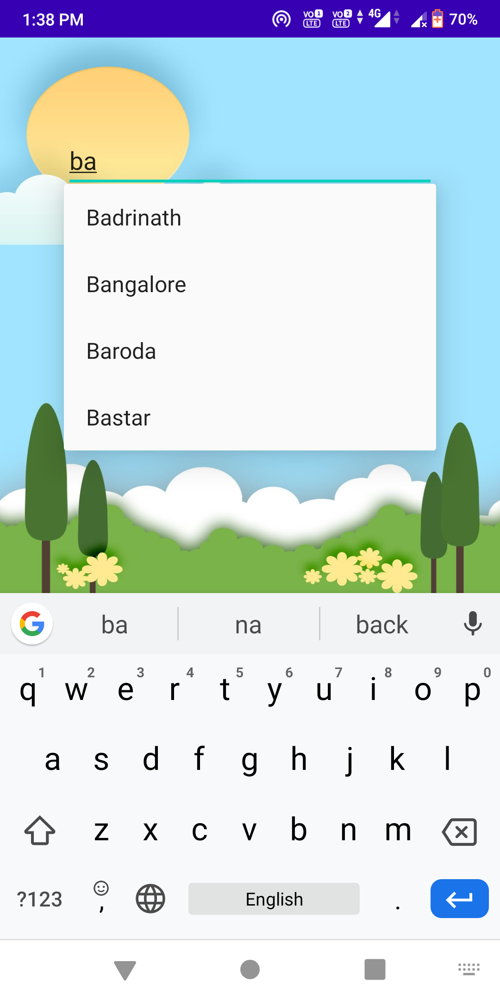

# Weather-App

WeatherMonitor is an Android App which will provide the user the weather state of a particular city. From the Api the data is being fetched using Retrofit and the User is getting the particular one week of Data/weather state  along with that the longitude and latitude of that particular city  which the user is trying to look/search.

# Screenshots

# Libraries this app uses
###### Retrofit Libraries - 
                            implementation 'com.squareup.retrofit2:retrofit:2.6.0'
                             implementation 'com.squareup.retrofit2:converter-gson:2.5.0'
                            implementation 'com.squareup.okhttp3:logging-interceptor:3.12.3'

###### Card View - 
                               implementation 'androidx.cardview:cardview:1.0.0'

  ###### RecyclerView - 
                         implementation "androidx.recyclerview:recyclerview:1.1.0"
   
  

# Permissions
###### Full Network Access
